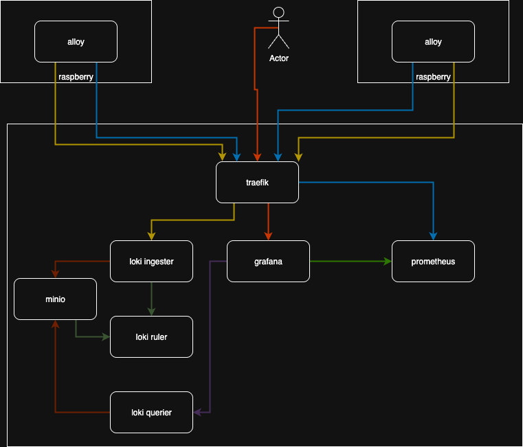

# grafana-suite-docker-compose

## Requirements

* [https://www.docker.com/](https://www.docker.com/)

## Diagram



## Install

### Init

Start All

```sh
docker compose up -d
```

Stop

```sh
docker compose stop
```

## Documentation

* [https://docs.docker.com/](https://docs.docker.com/)
* [https://doc.traefik.io/traefik/](https://doc.traefik.io/traefik/)
* [https://grafana.com/docs/](https://grafana.com/docs/)
* [https://docs.min.io/community/minio-object-store/index.html](https://docs.min.io/community/minio-object-store/index.html)

## Github

* [https://github.com/traefik/traefik](https://github.com/traefik/traefik)
* [https://github.com/grafana/grafana](https://github.com/grafana/grafana)
* [https://github.com/prometheus/prometheus](https://github.com/prometheus/prometheus)
* [https://github.com/prometheus/alertmanager](https://github.com/prometheus/alertmanager)
* [https://github.com/grafana/loki](https://github.com/grafana/loki)
* [https://github.com/minio/minio](https://github.com/minio/minio)
* [https://github.com/grafana/alloy](https://github.com/grafana/alloy)
