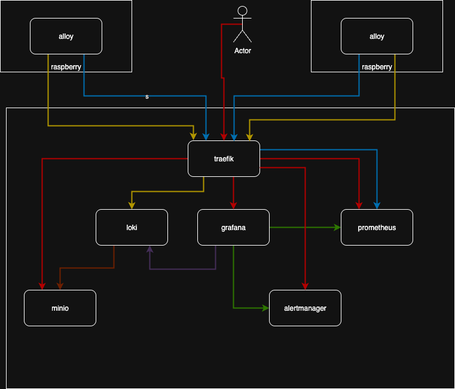

# grafana-suite-docker-compose

## Requirements

* [https://www.docker.com/](https://www.docker.com/)

## Diagram



## Install

### Init

Start All

```sh
docker compose up -d
```

Stop

```sh
docker compose stop
```

## Documentation

* [https://docs.docker.com/](https://docs.docker.com/)
* [https://grafana.com/docs/](https://grafana.com/docs/)
